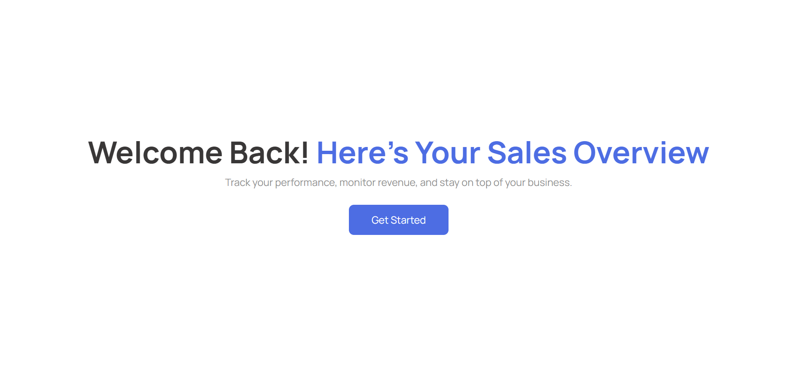
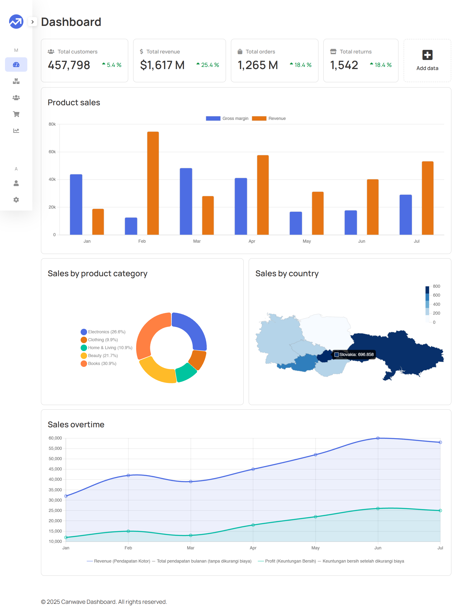
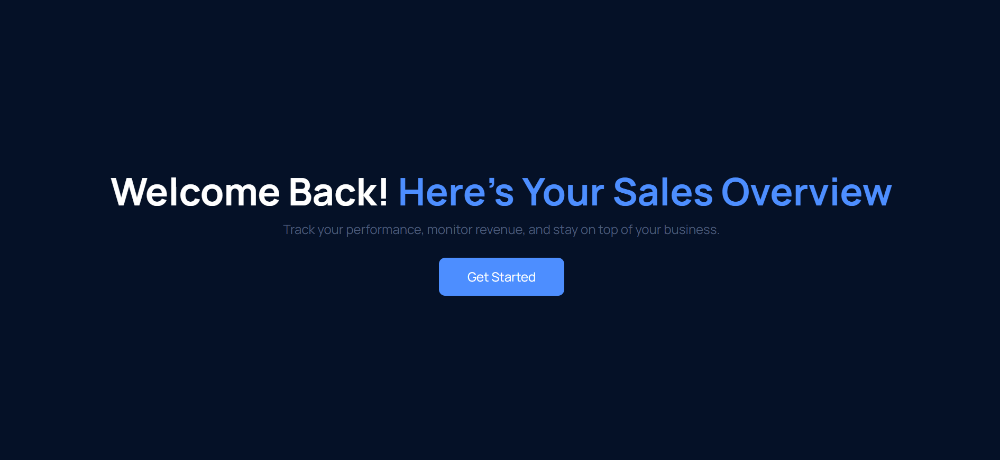
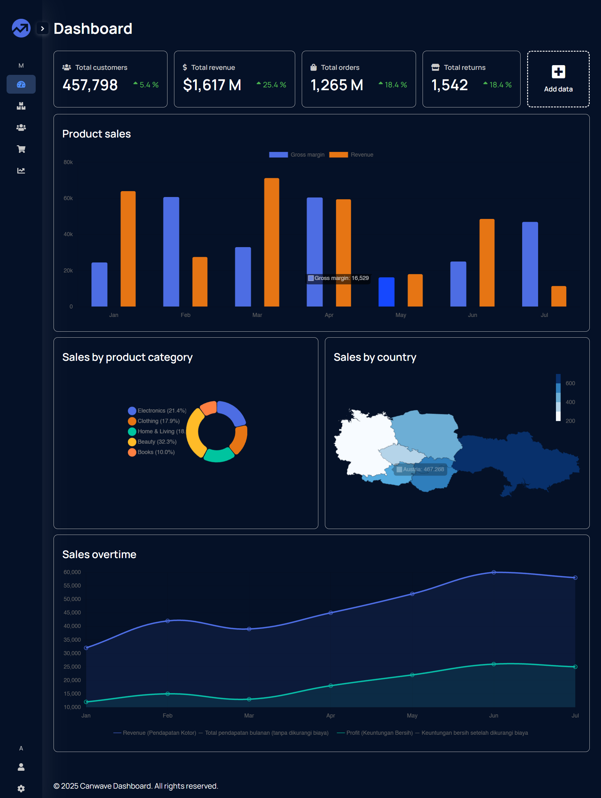

# 📊 (ENG) Sales Dashboard

Welcome to **Dashboard**, a responsive and modern sales dashboard web app built with vanilla HTML, CSS, JavaScript, and several open-source libraries.

This project is designed to help businesses monitor sales, track inventory, and analyze reports with a clean UI and great user experience.






---

## 🚀 Features

✅ Responsive Layout — Works seamlessly on desktop, tablet, and mobile  
✅ Sidebar Navigation — Collapsible sidebar for better usability  
✅ Sales Overview — Clear summary of business performance  
✅ Product & Order Management — Modular pages to manage inventory  
✅ Interactive Reports — Integrated with Chart.js and DataTables  
✅ Dark Theme Ready — Toggle between light/dark mode (in progress)  
✅ Single Page App (SPA) — Smooth routing using JavaScript modules  

---

## 🌐 Demo

- 🔗 **Live Demo (Production)**: [https://dashboard-template-v1.vercel.app/](https://dashboard-template-v1.vercel.app/)
- 🖥️ **Live Server (Dev Mode)**: [http://127.0.0.1:5500/public/](http://127.0.0.1:5500/public/)

> ⚠️ **Routing Notes:**
> - When running locally with **Live Server (VSCode)**: uses **hash routing** (e.g. `/#/dashboard`)
> - In production (e.g. deployed to Vercel): uses **pushState routing** (e.g. `/dashboard`), which requires server support (fallback to `index.html` for all routes)

---

## 📁 Folder Structure

```bash
.
├── assets/
│   ├── css/               # Custom styles (reset.css, style.css, responsive.css)
│   ├── images/            # Logos, backgrounds, and image assets
│   └── js/                # Layout scripts (e.g., layout.js)
│
├── lib/                   # External libraries
│   ├── chartJs/           # Chart.js & chartGeo
│   ├── dataTables/        # DataTables
│   ├── html2Canvas/       # html2canvas (PNG screenshot)
│   └── jQuery/            # jQuery 3.7.1
│
├── page/                  # JavaScript modules for each route/page
│   ├── account.js
│   ├── customers.js
│   ├── dashboard.js
│   ├── orders.js
│   ├── products.js
│   ├── reports.js
│   └── settings.js
│
├── public/                # Public assets
│   ├── favico.ico         # Favicon
│   └── cover.html         # Optional landing or splash page
│
├── index.html             # Main HTML entry (SPA container)
├── router.js              # JavaScript router for SPA navigation
├── LICENSE                # License file
└── README.md              # Project documentation
```

# 📊 (ID) Sales Dashboard

Selamat datang di **Dashboard**, aplikasi web dashboard penjualan yang modern dan responsif, dibangun menggunakan HTML, CSS, JavaScript (Vanilla JS), dan beberapa library open-source.

Proyek ini ditujukan untuk membantu bisnis dalam memantau penjualan, melacak produk, serta menganalisis laporan dengan antarmuka yang bersih dan pengalaman pengguna yang intuitif.


---

## 🚀 Fitur

✅ Layout Responsif — Berfungsi dengan baik di desktop, tablet, dan perangkat mobile  
✅ Navigasi Sidebar — Sidebar dapat dikompres untuk kenyamanan pengguna  
✅ Ringkasan Penjualan — Ikhtisar performa bisnis yang jelas  
✅ Manajemen Produk & Order — Halaman modular untuk inventaris  
✅ Laporan Interaktif — Integrasi dengan Chart.js dan DataTables  
✅ Mode Gelap — Mode terang/gelap siap digunakan (dalam pengembangan)  
✅ Aplikasi Single Page (SPA) — Navigasi mulus dengan modul JavaScript  

---

## 🌐 Demo

- 🔗 **Live Demo (Production)**: [https://dashboard-template-v1.vercel.app/](https://dashboard-template-v1.vercel.app/)
- 🖥️ **Live Server (Dev Mode)**: [http://127.0.0.1:5500/public/](http://127.0.0.1:5500/public/)

> ⚠️ **Catatan Routing:**
> - Saat dijalankan menggunakan **Live Server (VSCode)**: routing menggunakan `hash routing` (contoh: `/#/dashboard`)
> - Saat di-deploy ke production (seperti di Vercel): routing menggunakan `history.pushState` (tanpa hash), jadi perlu dukungan dari server-side untuk route fallback ke `index.html`.

---

## 📁 Struktur Folder

```bash
.
├── assets/
│   ├── css/               # Custom styles (reset.css, style.css, responsive.css)
│   ├── images/            # Logo, background, dan aset gambar
│   └── js/                # Script layout dan utilitas (layout.js, dsb.)
│
├── lib/                   # Library eksternal
│   ├── chartJs/           # Chart.js & chartGeo
│   ├── dataTables/        # DataTables
│   ├── html2Canvas/       # html2canvas (screenshot PNG)
│   └── jQuery/            # jQuery 3.7.1
│
├── page/                  # Modul JavaScript per halaman/route
│   ├── account.js
│   ├── customers.js
│   ├── dashboard.js
│   ├── orders.js
│   ├── products.js
│   ├── reports.js
│   └── settings.js
│
├── public/                # Aset publik
│   ├── favico.ico         # Favicon
│   └── cover.html         # Landing page opsional
│
├── index.html             # Halaman utama SPA
├── router.js              # File routing untuk navigasi SPA
├── LICENSE                # Informasi lisensi
└── README.md              # Dokumentasi proyek ini
```
