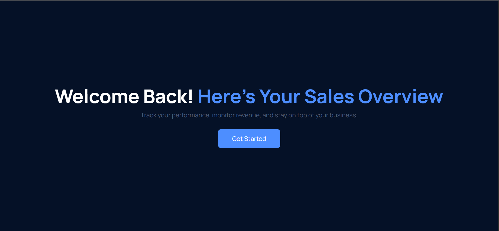

# 📊 Sales Dashboard (Dashboard Template made by Me)

Welcome to **Dashboard**, a responsive and modern sales dashboard web app built with vanilla HTML, CSS, JavaScript, and several open-source libraries. This project is designed to help businesses **monitor sales**, **track products**, and **analyze reports** with a clean UI and a powerful user experience.




---

## 🚀 Features

✅ **Responsive Layout** — Works smoothly on desktop, tablet, and mobile  
✅ **Sidebar Navigation** — Collapsible sidebar for better usability  
✅ **Sales Overview** — Clear and concise summary of business performance  
✅ **Product & Order Management** — Modular pages to manage inventory  
✅ **Interactive Reports** — Integrated with Chart.js and DataTables  
✅ **Dark Theme Ready** — Toggle-ready light/dark mode (planned)  
✅ **Single Page App (SPA)** — Smooth routing with JavaScript modules  

---

## 📁 Folder Structure

```bash
.
├── assets/
│   ├── css/               # Custom styles (reset.css, style.css, responsive.css)
│   ├── images/            # Logo, background, and image assets
│   └── js/                # Layout scripts (e.g., layout.js)
│
├── lib/                   # External libraries
│   ├── chartJs/           # Chart.js & chartGeo
│   ├── dataTables/        # DataTables library
│   ├── html2Canvas/       # html2canvas (screenshot PNG)
│   └── jQuery/            # jQuery 3.7.1
│
├── page/                  # JavaScript modules for each route/page
│   ├── account.js
│   ├── customers.js
│   ├── dashboard.js
│   ├── orders.js
│   ├── products.js
│   ├── reports.js
│   └── settings.js
│
├── public/                # Public assets
│   ├── favico.ico         # Favicon
│   └── cover.html         # Optional landing or splash page
│
├── index.html             # Main HTML entry (SPA container)
├── router.js              # JavaScript router for SPA navigation
├── LICENSE                # License file
└── README.md              # Project documentation
